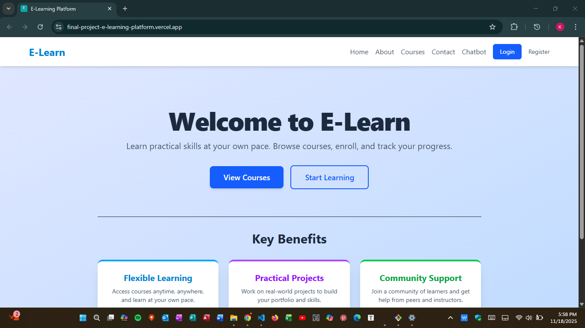
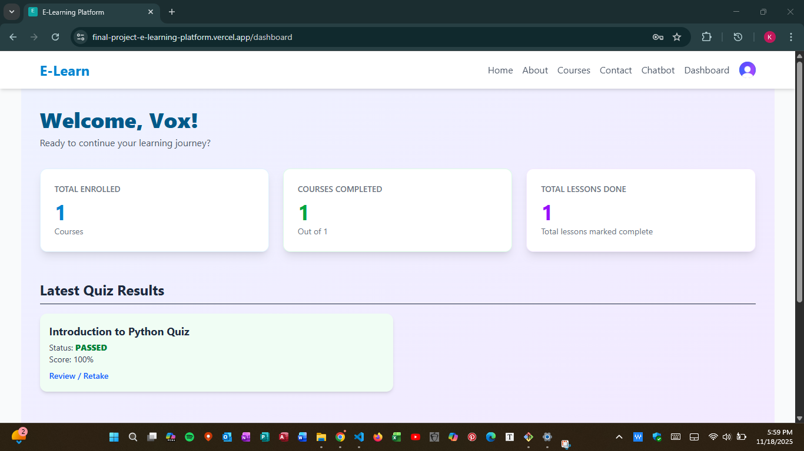
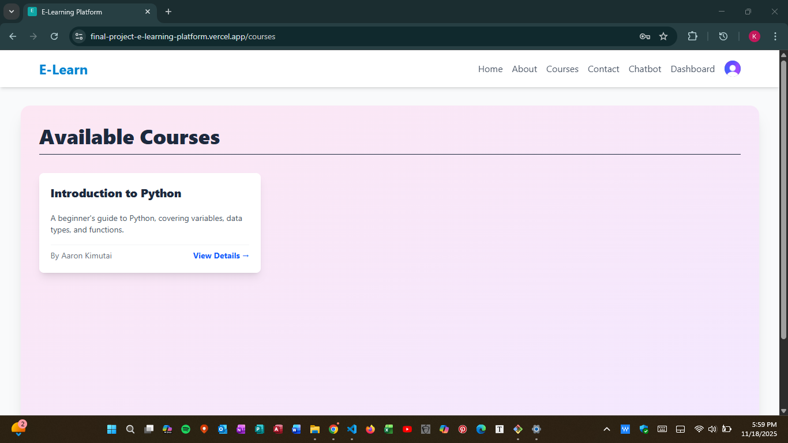
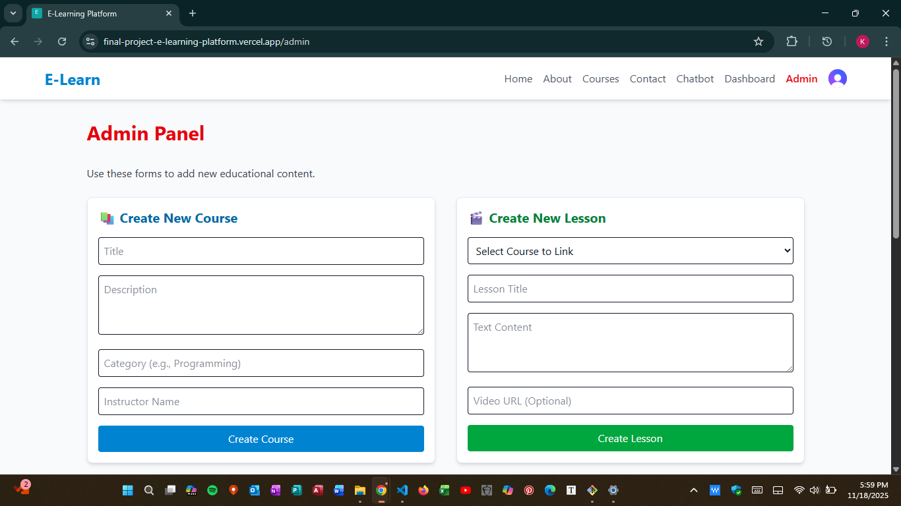

# 🎓 E-Learn Platform: Comprehensive MERN Stack Capstone Project  

## 🚀 Project Description  

The E-Learn Platform is a full-stack Learning Management System (LMS) designed to demonstrate mastery of the MERN (MongoDB, Express, React, Node.js) stack.  
This application solves the real-world problem of digital course delivery and personalized user progress tracking.  

### Key Features Implemented:  

Secure Authentication & Authorization: Implemented using Clerk for robust user and admin role management.  

Course Management (Admin): Full CRUD (Create, Read, Update, Delete) capability for courses, lessons, and quizzes via a protected Admin Panel.  

Personalized Dashboard: Displays enrolled courses, completion percentage, and latest quiz results for each authenticated user.  

Progress Tracking: Users can mark lessons as complete, which is persisted to the database and reflected in real-time progress bars.  

Quizzing System: Integrated final assessments with percentage scoring and pass/fail logic, stored and displayed on the Dashboard.  

Deployment: Separately deployed client (Vercel) and server (Render) to simulate a professional production environment.  

### 🛠️ Technical Stack  

#### Frontend  

React, React Router DOM, Axios, Tailwind CSS, Clerk/React  
 

#### Backend     

Node.js, Express.js, MongoDB, Mongoose  

#### Authentication  

Clerk, JWTs  

#### Deployment  

Vercel (Client), Render (Server)  

### ⚙️ Setup Instructions (Run Locally)  

Follow these steps to set up and run the E-Learn platform on your local machine.  

##### 1. Prerequisites  

Node.js (v18+)  

MongoDB Instance (Local or Atlas)  

Clerk Account for API Keys  

##### 2. Backend Setup  

Navigate to the server/ directory.  

Install dependencies:  

`npm install`  

Create a .env file in the server/ root and add the following variables:  

1. MongoDB connection string  
MONGO_URI=YOUR_MONGO_DB_CONNECTION_STRING  

2. Clerk Authentication Keys (Required for Auth Middleware)  
CLERK_SECRET_KEY=YOUR_CLERK_SECRET_KEY  
CLERK_FRONTEND_API=YOUR_CLERK_FRONTEND_API   

3. Port  
PORT=5000   

Start the backend server:  

`npm start`  

The server should start on http://localhost:5000.  

##### 3. Frontend Setup  

Navigate to the client/ directory.  

Install dependencies:  

`npm install`  

Create a .env file (or .env.local if using Vite) in the client/ root and add the following variables:  

1. Must point to your local backend   
VITE_API_URL="http://localhost:5000/api"   

2. Clerk Frontend Key  
VITE_CLERK_PUBLISHABLE_KEY=YOUR_CLERK_FRONTEND_API   

Start the frontend application:  

`npm run dev`  

The app should open at http://localhost:3000 (or similar).  
 

## ✅ Capstone Task Fulfillment Summary  

The project fulfills all core assignment tasks:  

| **Task**            | **Status**  | **Details** |
|---------------------|-------------|-------------|
| **Project Planning** | ✅ Complete | Wireframes, database schema (Users, Courses, Lessons, Progress), and API endpoint plan documented. |
| **Backend Dev**      | ✅ Complete | RESTful API with dedicated routes (`/api/users`, `/api/courses`, etc.), Mongoose validation, and Clerk authentication middleware (`server.js`). |
| **Frontend Dev**     | ✅ Complete | Responsive UI, React Router (`App.jsx`), reusable components, and Axios integration (`axiosInstance.js`) for data handling. |
| **Testing & QA**     | ✅ Complete | Implemented unit tests for controllers/utilities and integration tests using Supertest for API routes (located in `server/tests/`). |
| **Deployment**       | ✅ Complete | Production deployment of the client (Vercel) and server (Render), successfully communicating via environment variables. |

## 🔗 Submission Links and Demonstration

### **Live Application**
**Status:** Deployed  
**Link:** _[https://final-project-e-learning-platform.vercel.app/]_

### **Video Demonstration**
**Status:** Recorded  
**Link:** _[https://drive.google.com/file/d/1TFyWdE6fx99gUqyxegPf7NE-xCx9FddG/view?usp=sharing]_

### **Screenshots**
### Login/Registration

### Dashboard

### Course Detail Page

### Admin Panel

### **Source Code**
**Status:** Complete  
The full client and server implementations are located within the `client/` and `server/` directories of this repository.
